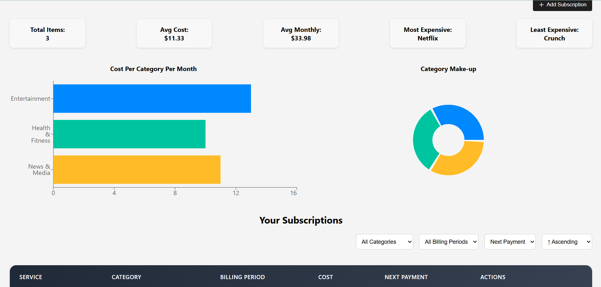

# Trakr - Subscription Management App

A modern, full-stack web application for tracking and managing your recurring subscriptions. Built with React, Node.js, Express, MongoDB, and Firebase Authentication.

## 🌟 Features
### 📊 Dashboard Analytics
- **Comprehensive Analytics:** Track total subscriptions, average costs, and monthly spending
- **Visual Charts:** Interactive pie charts and bar charts showing category breakdown
- **Cost Analysis:** View spending patterns across different subscription categories

### 💼 Subscription Management
- **Add Subscriptions:** Easy-to-use modal for adding new subscriptions
- **Edit & Delete:** Inline editing with intuitive controls
- **Categorization:** Organize subscriptions by Entertainment, Productivity, Health & Fitness, and more
- **Billing Periods:** Support for weekly, monthly, and yearly billing cycles

### 🔍 Filtering & Sorting
- **Category Filters:** Filter subscriptions by category
- **Billing Period Filters:** View subscriptions by billing frequency
- **Sorting Options:** Sort by name, cost, or next payment date
- **Real-Time Updates:** Automatic payment date calculations

### 🔐 Authentication
- **Firebase Auth:** Secure authentication with Google OAuth and email/password
- **Protected Routes:** User-specific data with secure API endpoints
- **Session Management:** Persistent login state across browser sessions

## 🛠️ Tech Stack
### Frontend
- **React 18:** Modern UI library with hooks
- **React Router:** Client-side routing
- **Recharts:** Interactive data visualization
- **Lucide React:** Beautiful icon library
- **CSS3:** Custom styling with animations and responsive design

## Backend
- **Node.js:** Javascript runtime
- **Express.js:** Web application framework
- **MongoDB:** NoSQL database with Mongoose ODM
- **Firebase Admin SDK:** Authentication and authorization

## Authentication & Security
- **Firebase Authentication:** User management and OAuth
- **JWT Token Verification:** Secure API endpoints
- **CORS:** Cross-origin resource sharing configuration

## Author
Made by Dylan Giletto
[Portfolio](https://portfolio-dgilettos-projects.vercel.app/) | [LinkedIn](https://www.linkedin.com/in/dylan-giletto-775789269/) | [Github](https://github.com/dgiletto)

Link to the Web App: https://subscription-trakr.netlify.app/
